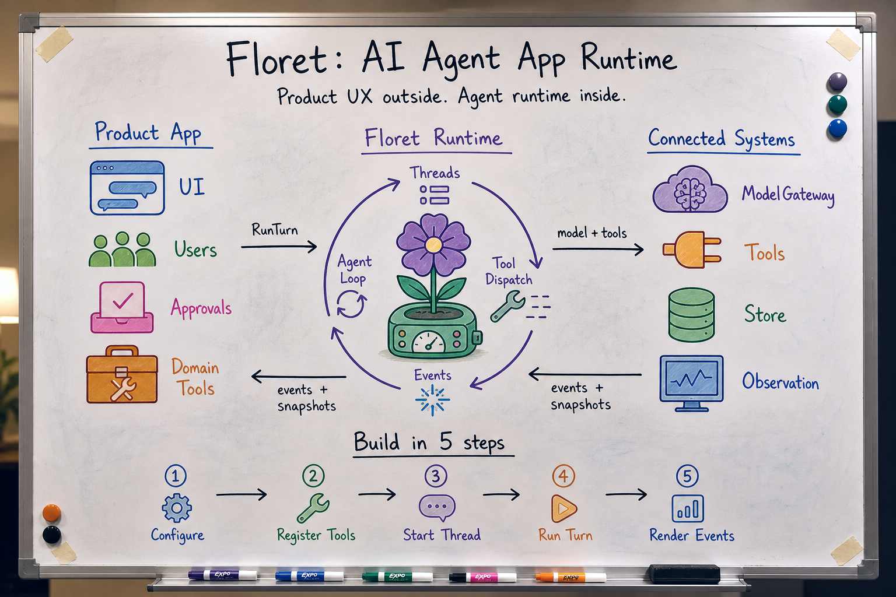

# Floret

<!-- readme-locales:start -->
<p align="center">
  <strong>English</strong> |
  <a href="README.zh-CN.md">简体中文</a> |
  <a href="README.zh-TW.md">繁體中文</a> |
  <a href="README.ja-JP.md">日本語</a> |
  <a href="README.ko-KR.md">한국어</a> |
  <a href="README.de-DE.md">Deutsch</a> |
  <a href="README.fr-FR.md">Français</a> |
  <a href="README.es-ES.md">Español</a> |
  <a href="README.pt-BR.md">Português do Brasil</a> |
  <a href="README.ru-RU.md">Русский</a>
</p>
<!-- readme-locales:end -->

<p align="center">
  <strong>The agent runtime that leaves your product in your hands.</strong><br />
  Durable conversations, tool execution, context lifecycle, and observable runtime facts for Go applications.
</p>

<p align="center">
  <a href="https://pkg.go.dev/github.com/floegence/floret/runtime">
    
  </a>
  <a href="./LICENSE">
    
  </a>
  
</p>

<p align="center">
  <a href="#-why-floret">Why Floret</a> ·
  <a href="#-at-a-glance">At a glance</a> ·
  <a href="#what-you-keep">What You Keep</a> ·
  <a href="#quick-start">Quick Start</a> ·
  <a href="#production-shape">Production Shape</a> ·
  <a href="#-stable-downstream-api">Stable API</a>
</p>



## ✨ Why Floret

Most agent libraries help a model call a tool. Shipping a serious agent product
requires much more: a resilient model loop, a durable conversation record,
approval-aware tool execution, long-context management, recoverable work, and
runtime facts your UI can trust.

Floret provides that runtime without taking over the product around it. It is
not an agent UI, a workflow graph, or a multi-agent framework. It is the Go
layer behind the experience you are building.

That distinction matters when your product needs to be genuinely its own. You
can keep your interface, identity system, permission model, model routing,
secrets, data model, and domain tools while delegating the difficult agent
execution lifecycle to Floret.

### Built for products that cannot accept a preset

- **Bring your model path.** Use built-in configuration or provide a
  `runtime.ModelGateway`; Floret drives the request and continuation lifecycle
  while your product retains transport and credential control.
- **Give every agent a business-native role.** Set
  `config.AgentProfile.SystemPrompt` or `config.Config.SystemPrompt` to define
  the role, voice, business scenario, and operating rules your product needs,
  rather than shipping a generic assistant.
- **Keep tools and instructions in step with the work.** Register strict domain
  tools with `tools.Registry`, then use `runtime.ToolSurfaceProvider` to
  refresh tools, hosted capabilities, instructions, and host context at safe
  points during a run.
- **Keep conversations durable.** `runtime.Host` manages threads, turns,
  retries, forks, parent-managed child threads, and provider-safe history.
- **Put approval policy where it belongs.** Floret understands generic effects,
  resources, and approval state. Your product decides who may do what, where,
  and why.
- **Make runtime behavior visible.** Stream sanitized events, context pressure,
  compaction facts, and neutral activity timelines into any UI without exposing
  prompts, secrets, or internal storage records.
- **Test the product, not a model.** The fake provider makes agent flows
  deterministic in local and CI tests.

## 🧭 At a glance

| You need to... | Use... |
| --- | --- |
| Configure an agent and a provider | `config.Config` or `config.Load` |
| Run durable conversations | `runtime.NewHost` and `runtime.Host` |
| Compact an idle thread | `runtime.CompactThreadRequest` |
| Keep Floret runtime data in memory or SQLite | `runtime.NewMemoryStore` or `runtime.OpenSQLiteStore` |
| Keep model transport under product control | `runtime.ModelGateway` |
| Define an agent's role and business instructions | `config.AgentProfile.SystemPrompt` or `config.Config.SystemPrompt` |
| Change tools and instructions during a run | `runtime.ToolSurfaceProvider` |
| Register domain actions | `tools.Registry` |
| Render neutral runtime facts | `runtime.EventSink` and `observation` DTOs |

## What You Keep

Floret has a deliberately narrow boundary. It owns engine mechanics; your
application owns every product decision.

| Floret runs | Your application decides |
| --- | --- |
| Provider loop, retries, tool continuation, and finish state | When users can start, retry, interrupt, or cancel work |
| Durable thread journal, prompt scope, provider ledger, and runtime artifacts | Users, workspaces, billing, product metadata, and retention policy |
| Tool schema validation, generic effect metadata, approval lifecycle, and result projection | Authorization, approval UX, domain actions, and user-facing copy |
| Context pressure, compaction lifecycle, and provider-visible history | What product data is safe to supply and how it appears in the interface |
| Sanitized events and neutral activity facts | Layout, workflows, controls, routing, and diagnostics policy |

This is what lets an operations console, a coding environment, a support tool,
or an industry-specific assistant share a dependable runtime without becoming
the same product.

## Quick Start

Install the stable downstream packages:

```bash
go get github.com/floegence/floret/config github.com/floegence/floret/runtime github.com/floegence/floret/tools github.com/floegence/floret/observation
```

Start a durable thread with the deterministic fake provider:

```go
package main

import (
	"context"
	"fmt"
	"log"

	"github.com/floegence/floret/config"
	"github.com/floegence/floret/runtime"
)

func main() {
	ctx := context.Background()

	host, err := runtime.NewHost(runtime.HostOptions{
		Config: config.Config{
			Provider:     config.ProviderFake,
			Model:        "fake-model",
			FakeResponse: "Hello from Floret.",
			AgentProfile: config.AgentProfile{
				ID:           "support-agent",
				Name:         "Support Agent",
				SystemPrompt: "Answer clearly and briefly.",
			},
		},
		Store: runtime.NewMemoryStore(),
	})
	if err != nil {
		log.Fatal(err)
	}
	defer host.Close()

	thread, err := host.StartThread(ctx, runtime.StartThreadRequest{ThreadID: "thread-1"})
	if err != nil {
		log.Fatal(err)
	}

	result, err := host.RunTurn(ctx, runtime.RunTurnRequest{
		ThreadID: thread.ID,
		TurnID:   "turn-1",
		RunID:    "run-1",
		Input:    "Welcome a new customer in one sentence.",
	})
	if err != nil {
		log.Fatal(err)
	}
	fmt.Println(result.Output)
}
```

Replace the fake configuration with an OpenAI-compatible gateway or a
host-supplied `runtime.ModelGateway` when your product owns model transport.
Use `runtime.OpenSQLiteStore(path)` when Floret should persist its own runtime
data. Your product data stays in your own store, keyed by `runtime.ThreadID`.

## Production Shape

### Let prompts carry product intent

Floret does not prescribe a generic persona. Give an agent its initial role,
voice, business scenario, and operating rules through
`config.AgentProfile.SystemPrompt` or `config.Config.SystemPrompt`. The prompt
is host-owned product configuration, so different agents can behave like a
support specialist, an operations analyst, a coding assistant, or a domain
expert without changing the runtime.

For context-dependent behavior, return a `runtime.ToolSurface` from a
`ToolSurfaceProvider`. It can replace the current system prompt alongside the
tool surface, hosted capabilities, and host context. This is useful when a
conversation moves between product modes, workspaces, permissions, or business
stages. Floret refreshes that surface before model requests and local dispatch,
so an old model decision cannot silently run under newer instructions or
product policy.

### Give the runtime only the authority it needs

Define domain actions through `tools.Registry`. Each tool has a strict JSON
schema and can describe its effects and resources. Floret validates the call,
runs approval when required, dispatches the handler, records the outcome, and
returns a provider-visible result. The handler must still enforce your
authorization rules.

| Tool concern | Floret handles | Host handles |
| --- | --- | --- |
| Schema | strict provider-visible JSON shape | domain argument meaning |
| Permission | generic approval hook and effect metadata | product authorization policy |
| Execution | scheduling, panic recovery, and result projection | the domain action itself |
| Output | model projection, neutral activity, and artifact references | product-specific display choices |

### Design around explicit identity

Keep Floret's runtime identities in product work records:

- `ThreadID` identifies the durable conversation.
- `TurnID` identifies one user-facing turn.
- `RunID` identifies one concrete provider execution.
- `PromptScopeID` identifies prompt-cache and provider-ledger reuse.

They are intentionally separate. For example, a host-owned process that later
settles pending tool work must use the recorded Floret `ThreadID`, `TurnID`, and
`RunID`, rather than a UI, audit, or display identifier.

### Render facts, not engine internals

Send a `runtime.EventSink` to receive sanitized lifecycle events and use the
`observation` DTOs for context pressure, compaction, and activity timelines.
Events are designed for host rendering and diagnostics; they are not a secret
store or a replacement for your product database.

When a host needs a durable display projection, use `ThreadTurnProjection` and
the public detail APIs. Do not read Floret's storage tables or rebuild
provider-visible history in the host.

Every turn projection carries `ThroughOrdinal`, the greatest durable detail
event ordinal included in that projection. Compare it only within the explicit
thread, turn, and run identities to reject duplicate or stale projections.
`ProjectedAt` is observation time only and is not an ordering key.

### Runtime flow

```text
Host UI/API
  |
  | StartThread / RunTurn / CompactThread / RetryTurn
  v
runtime.Host
  |
  | provider loop, durable journal, tool dispatch, context lifecycle
  v
Floret runtime
```

### Run it with confidence

Floret is deterministic with the fake provider, so tool behavior, approval
flows, retries, context pressure, and host UI projections can be tested without
real model calls.

```bash
go test ./...
go run ./cmd/floret-test-ui
```

The local test console is for contributors to inspect fake-provider sessions,
sanitized events, tool scenarios, and hosted child threads. It is not a
downstream integration surface.

## 📦 Stable downstream API

Downstream applications should import only these public packages:

```text
github.com/floegence/floret/config
github.com/floegence/floret/runtime
github.com/floegence/floret/tools
github.com/floegence/floret/observation
```

Everything under `internal/` is implementation detail. The package reference at
[pkg.go.dev](https://pkg.go.dev/github.com/floegence/floret/runtime) is the API
source of truth; [the OKF knowledge bundle](okf/index.md) explains the runtime's
architecture and vocabulary for contributors.

## License

Floret is licensed under the [MIT License](LICENSE).
